## Testing with Postman

### 1. Test Public Routes (No Authentication Required)

#### Get Home Page
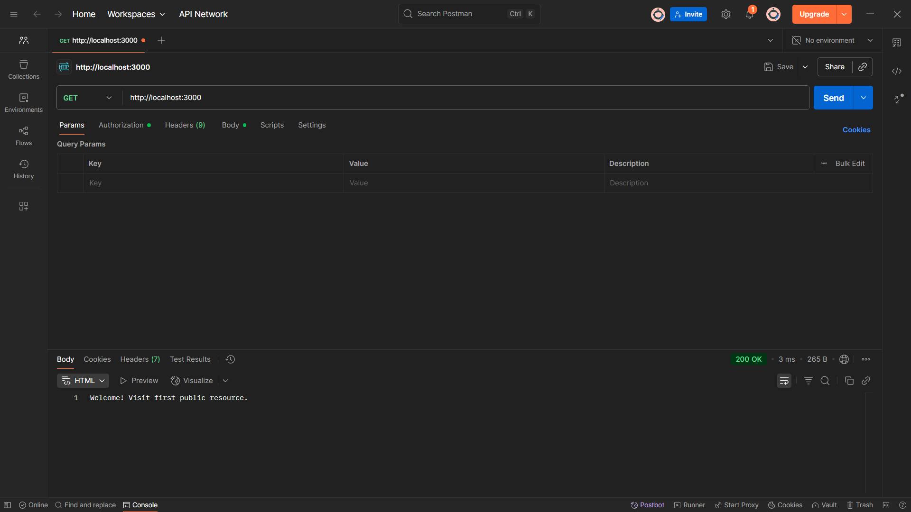

#### Get Public Page

### 2. Test Protected Route (Basic Authentication Required)

#### Access Secure Route Without Authentication
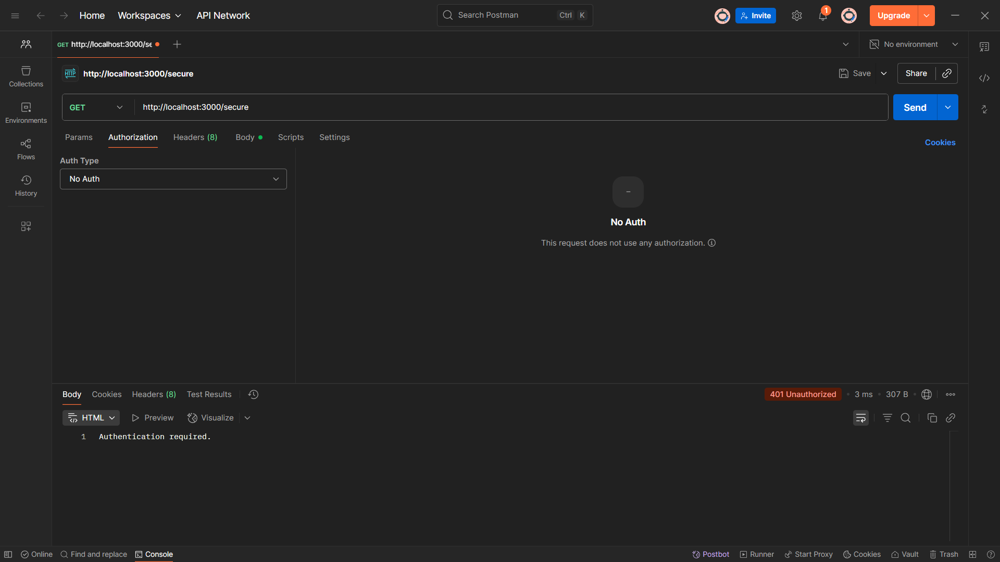

#### Access Secure Route With Correct Credentials
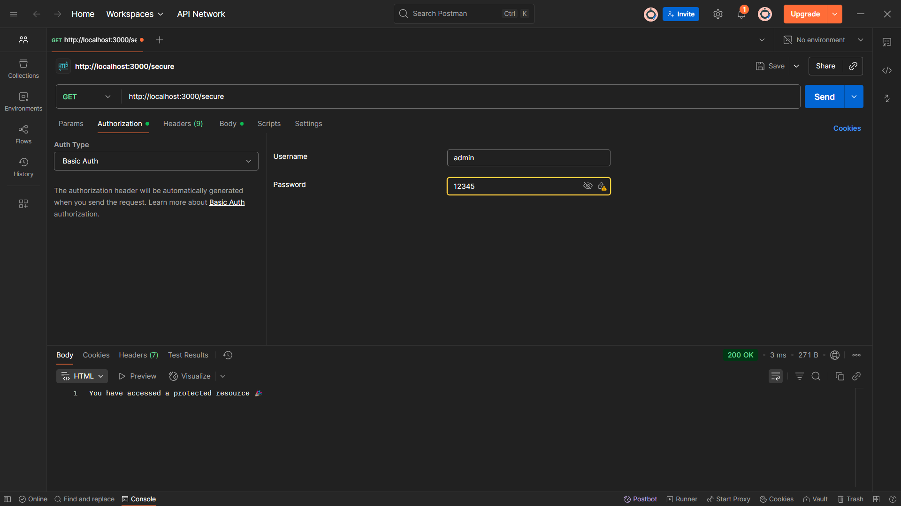

#### Access Secure Route With Wrong Credentials
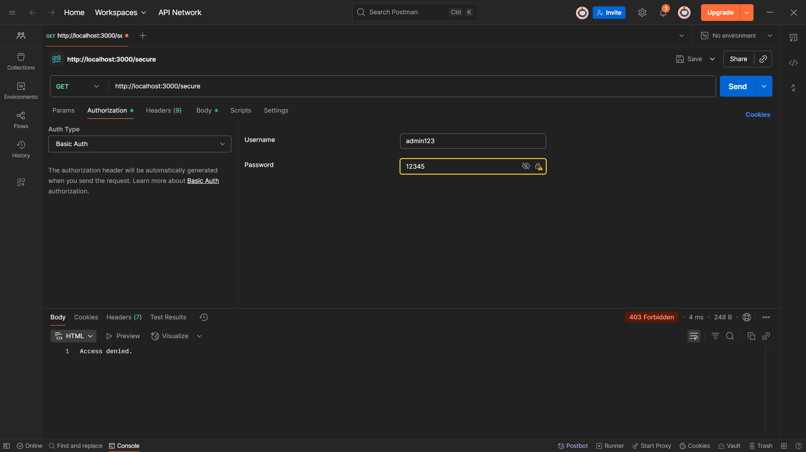

## 2. Cookie Authentication (cookie_auth.js - Port 3001)

### Login (Create Cookie Session)
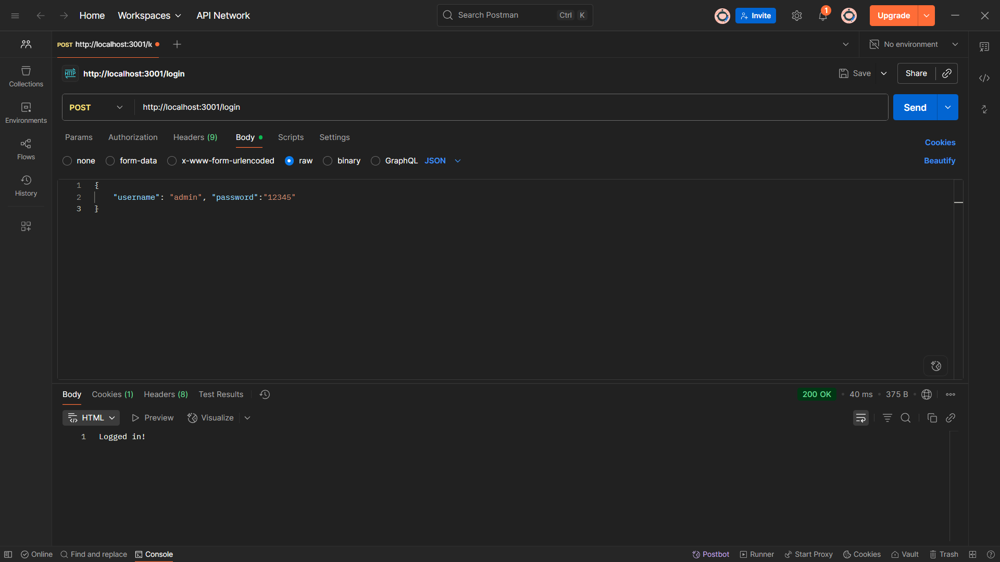

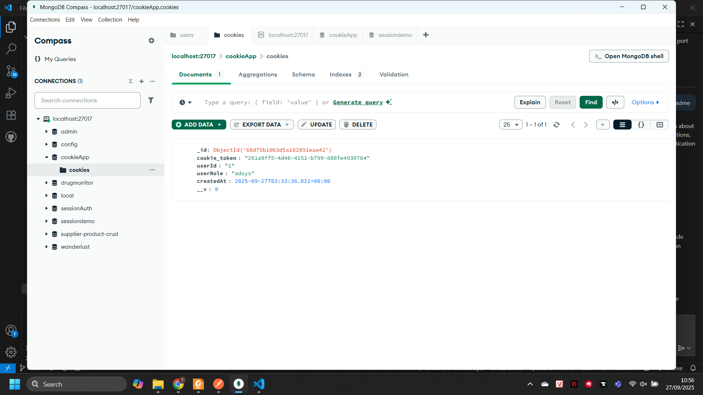

### Access Protected Profile (With Valid Cookie)
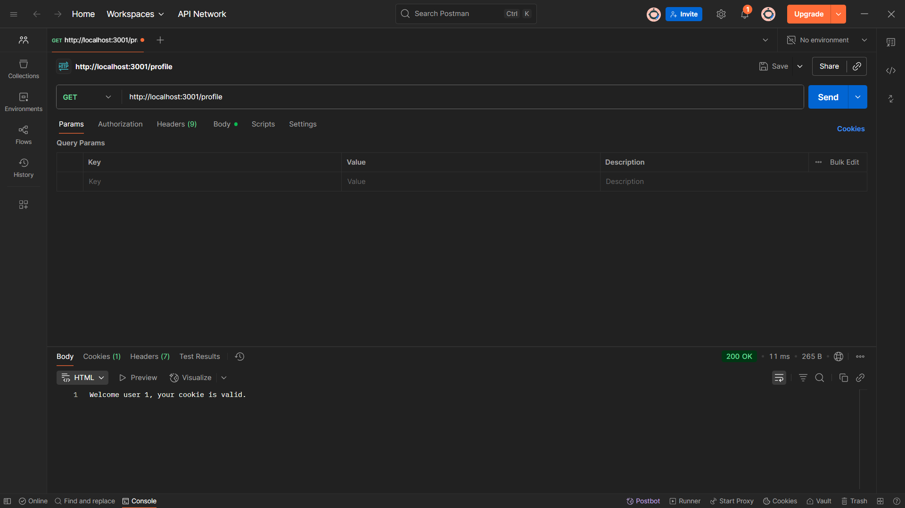

### Logout (Clear Cookie Session)
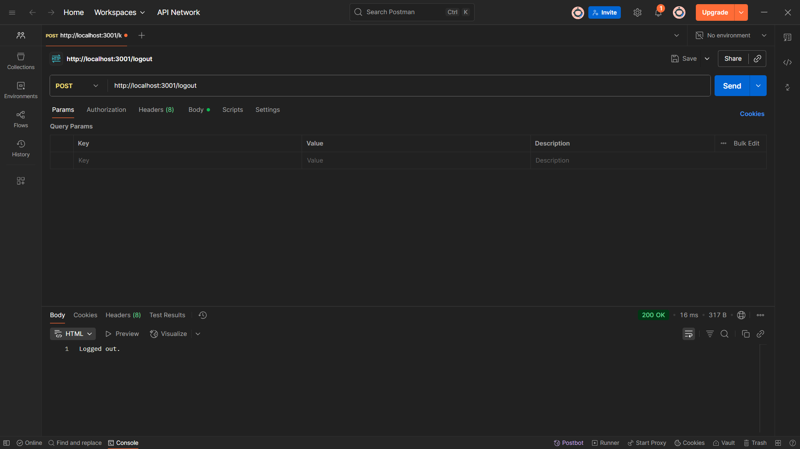
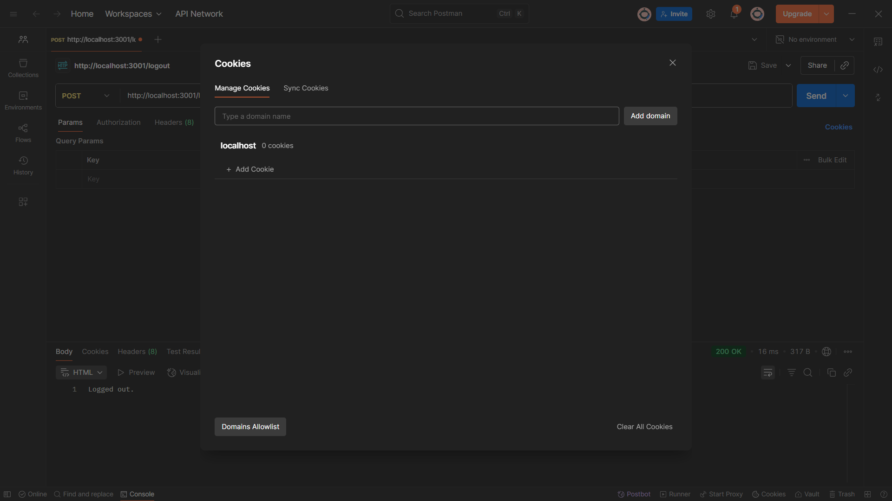
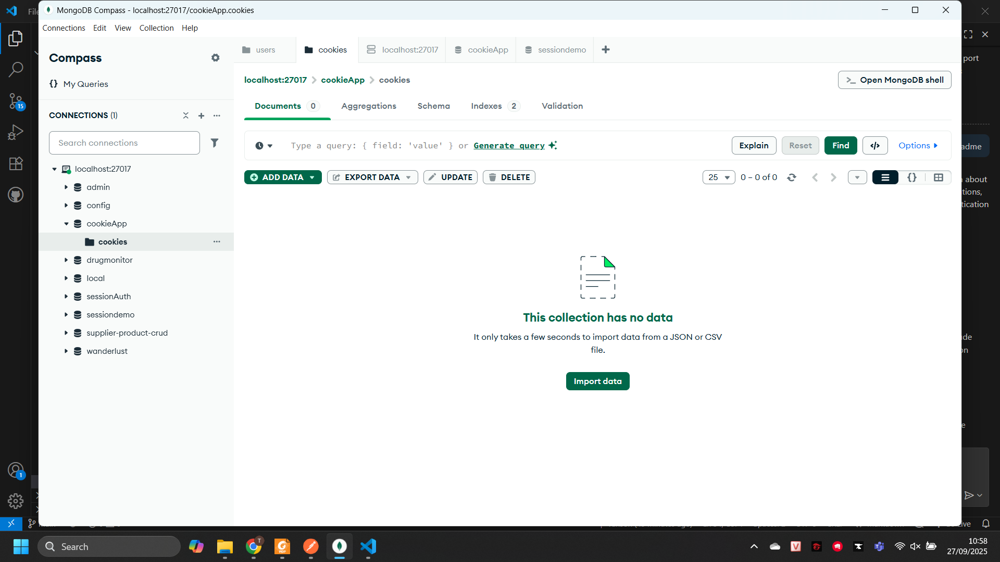

### Access Protected Profile (Without Cookie)
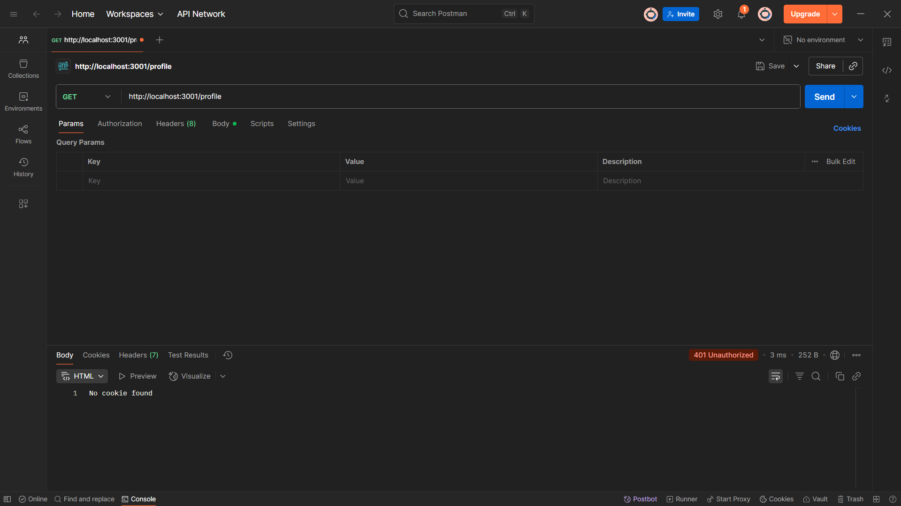

### Testing Invalid Credentials
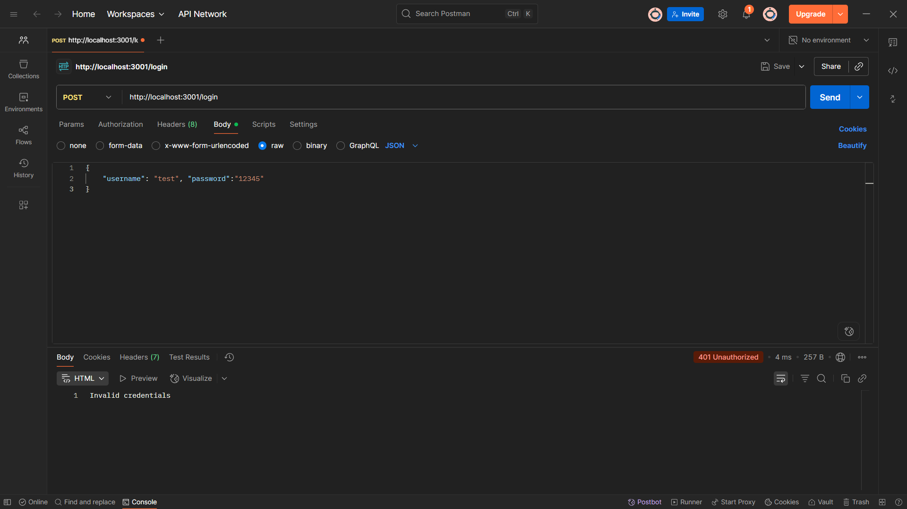

